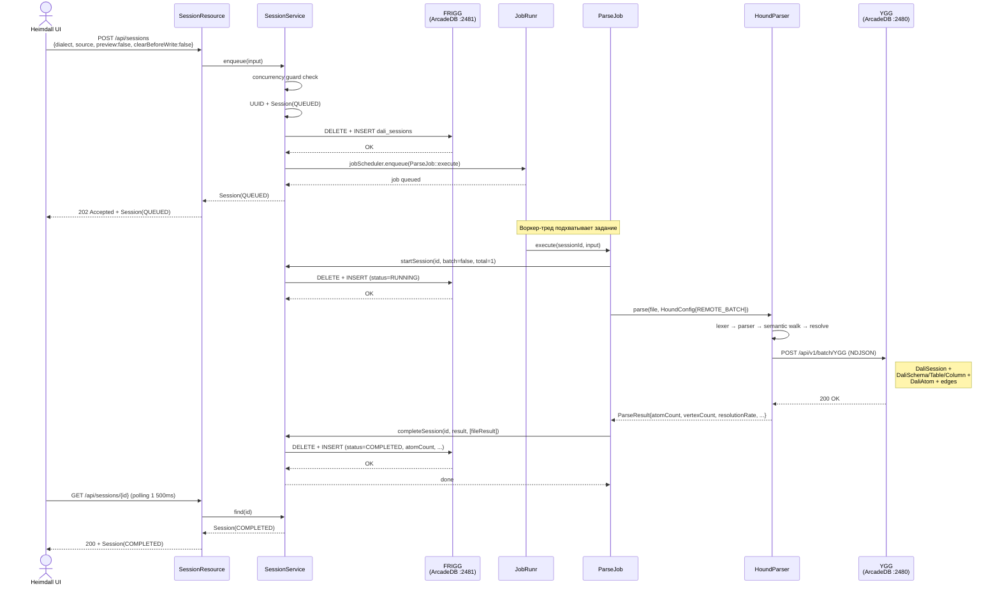
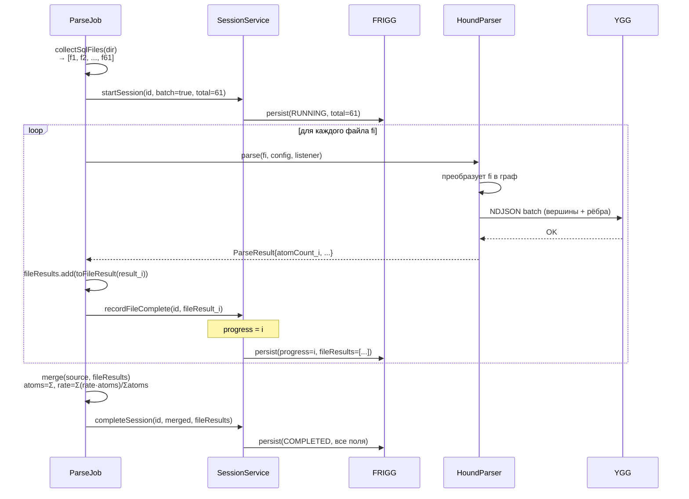
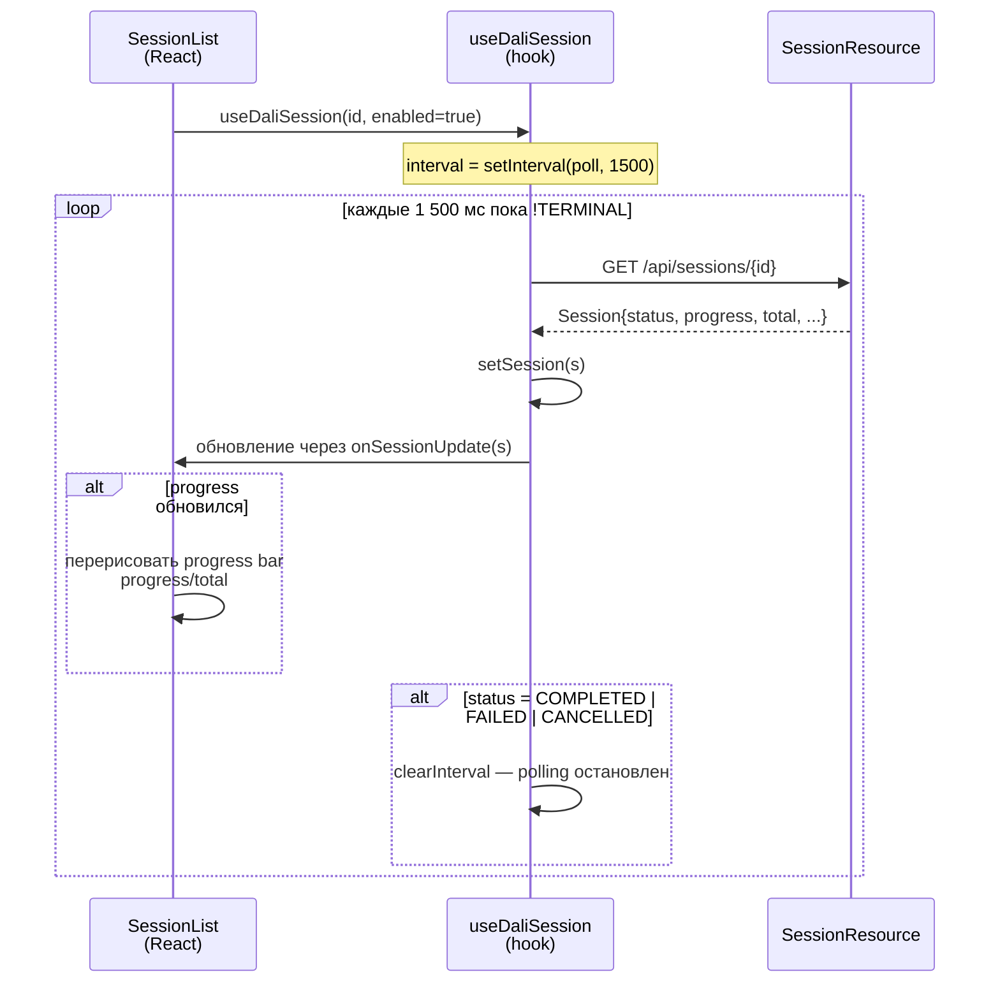
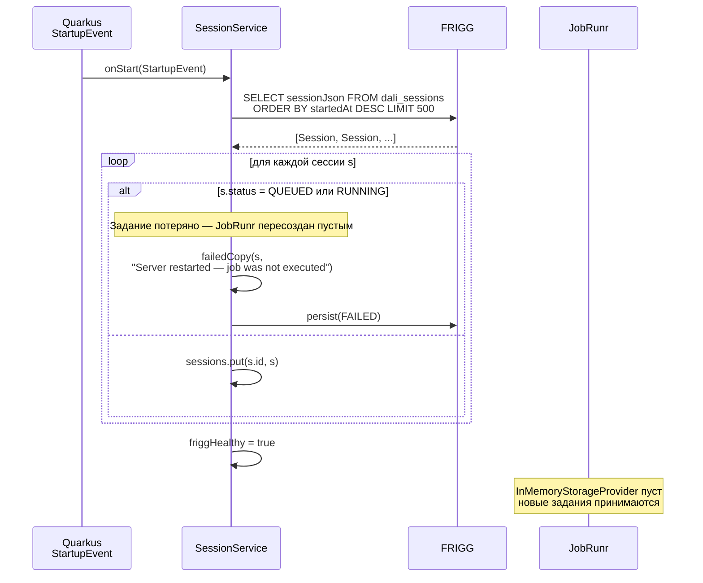
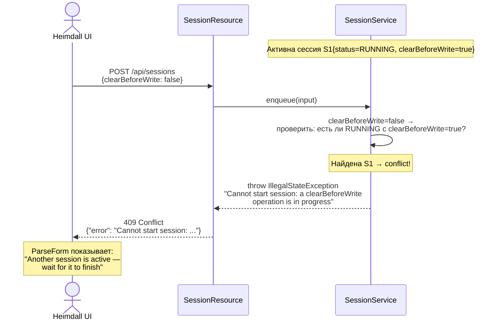
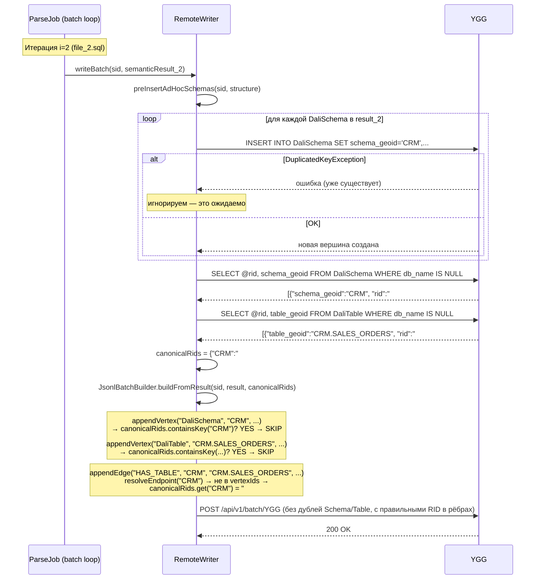

# Dali — Детальное описание алгоритмов, интеграций и модели данных

> Дата: 2026-04-13 · Sprint S1  
> Компоненты: `services/dali` · `libraries/hound` · `shared/dali-models`

---

## Содержание

1. [Системный контекст](#1-системный-контекст)
2. [Интеграции](#2-интеграции)
   - 2.1 [Heimdall ↔ Dali (REST)](#21-heimdall--dali-rest)
   - 2.2 [Dali ↔ FRIGG (ArcadeDB :2481)](#22-dali--frigg-arcadedb-2481)
   - 2.3 [Hound ↔ YGG (ArcadeDB :2480, NDJSON Batch)](#23-hound--ygg-arcadedb-2480-ndjson-batch)
   - 2.4 [Dali ↔ JobRunr (in-process)](#24-dali--jobrunr-in-process)
3. [Модель данных](#3-модель-данных)
   - 3.1 [ParseSessionInput — входные данные](#31-parsesessioninput--входные-данные)
   - 3.2 [Session — сессия в памяти и FRIGG](#32-session--сессия-в-памяти-и-frigg)
   - 3.3 [FileResult — результат одного файла](#33-fileresult--результат-одного-файла)
   - 3.4 [dali_sessions — схема документов в FRIGG](#34-dali_sessions--схема-документов-в-frigg)
   - 3.5 [Граф-типы в YGG — все вершины и рёбра](#35-граф-типы-в-ygg--все-вершины-и-рёбра)
   - 3.6 [RidCache — внутреннее кэширование Hound](#36-ridcache--внутреннее-кэширование-hound)
4. [Алгоритмы подсчёта](#4-алгоритмы-подсчёта)
   - 4.1 [atomCount — что считается](#41-atomcount--что-считается)
   - 4.2 [vertexCount и edgeCount](#42-vertexcount-и-edgecount)
   - 4.3 [resolutionRate — взвешенное среднее](#43-resolutionrate--взвешенное-среднее)
   - 4.4 [Накопление данных в YGG и clearBeforeWrite](#44-накопление-данных-в-ygg-и-clearbeforewrite)
   - 4.5 [UI Stats Strip — откуда берутся цифры](#45-ui-stats-strip--откуда-берутся-цифры)
   - 4.6 [DaliSession:164 — почему не совпадает с числом сессий](#46-dalisession164--почему-не-совпадает-с-числом-сессий)
5. [Sequence-диаграммы](#5-sequence-диаграммы)
   - 5.1 [Однофайловый парсинг (preview=false)](#51-однофайловый-парсинг-previewfalse)
   - 5.2 [Пакетный парсинг (директория)](#52-пакетный-парсинг-директория)
   - 5.3 [clearBeforeWrite flow](#53-clearbeforewrite-flow)
   - 5.4 [UI polling — отслеживание прогресса](#54-ui-polling--отслеживание-прогресса)
   - 5.5 [Startup recovery (рестарт Dali)](#55-startup-recovery-рестарт-dali)
   - 5.6 [Concurrency guard — 409 Conflict](#56-concurrency-guard--409-conflict)
6. [Алгоритм дедупликации вершин (Hound batch)](#6-алгоритм-дедупликации-вершин-hound-batch)
7. [Concurrency guard — детали](#7-concurrency-guard--детали)

---

## 1. Системный контекст

```
┌──────────────────────────────────────────────────────────────────────────┐
│                         HEIMDALL :5174                                   │
│              React SPA (Vite dev proxy /dali → :9090)                   │
│                                                                          │
│   DaliPage                                                               │
│     ├── ParseForm      POST /dali/api/sessions                           │
│     ├── SessionList    GET  /dali/api/sessions/{id}  (polling 1 500 ms) │
│     └── Footer         GET  /dali/api/sessions/health (polling 15 000 ms)│
└───────────────────────────┬──────────────────────────────────────────────┘
                            │ HTTP
                            ▼
┌──────────────────────────────────────────────────────────────────────────┐
│                         DALI :9090  (Quarkus)                            │
│                                                                          │
│  SessionResource (JAX-RS)                                                │
│        │                                                                 │
│        ▼                                                                 │
│  SessionService                    SessionRepository                     │
│  ConcurrentHashMap<id, Session>  ←→  FriggGateway                      │
│        │                                   │ HTTP Basic Auth             │
│        │                                   ▼                             │
│        │                           FRIGG :2481 (ArcadeDB)               │
│        │                           db: FRIGG                             │
│        │                           type: dali_sessions (Document)        │
│        │                                                                 │
│        ▼                                                                 │
│  JobScheduler (JobRunr, InMemory)                                        │
│        │                                                                 │
│        ▼                                                                 │
│  ParseJob (background thread)                                            │
│        │                                                                 │
│        ▼                                                                 │
│  HoundParser.parse() — in-JVM                                            │
│        │                                                                 │
│        ▼                                                                 │
│  RemoteWriter                                                            │
│        │ HTTP POST /api/v1/batch/{db}  NDJSON                           │
│        ▼                                                                 │
│  YGG :2480 (ArcadeDB)                                                    │
│  db: YGG                                                                 │
│  vertex types: DaliAtom, DaliTable, DaliColumn, ...                     │
└──────────────────────────────────────────────────────────────────────────┘
```

---

## 2. Интеграции

### 2.1 Heimdall ↔ Dali (REST)

**Транспорт:** HTTP/1.1, JSON, Basic Auth отсутствует (внутренняя сеть).  
**Прокси в dev:** Vite переписывает `/dali/*` → `http://localhost:9090/*`.

#### Контракты эндпоинтов

| Метод | Путь | Тело запроса | Тело ответа | Коды |
|-------|------|-------------|------------|------|
| `POST` | `/api/sessions` | `ParseSessionInput` (JSON) | `Session` (JSON) | 202, 400, 409 |
| `GET` | `/api/sessions?limit=N` | — | `Session[]` (JSON) | 200 |
| `GET` | `/api/sessions/{id}` | — | `Session` (JSON) | 200, 404 |
| `GET` | `/api/sessions/health` | — | `{"frigg":"ok\|error","sessions":N}` | 200 |

#### Polling из UI

```
SessionList монтирует useDaliSession(id, enabled) для каждой активной строки
    │
    ├─ interval = setInterval(poll, 1_500 ms)
    │
    └─ poll():
         GET /dali/api/sessions/{id}
         ├─ success → setSession(s), если TERMINAL → clearInterval
         └─ error   → warn (не прерывает polling)

TERMINAL = { COMPLETED, FAILED, CANCELLED }
```

#### Health polling из DaliPage

```
useEffect на mount:
    checkFrigg()
    interval = setInterval(checkFrigg, 15_000 ms)

checkFrigg():
    GET /dali/api/sessions/health
    ├─ success → setFriggHealthy(h.frigg === 'ok')
    └─ error   → setFriggHealthy(false)
```

---

### 2.2 Dali ↔ FRIGG (ArcadeDB :2481)

**Транспорт:** HTTP REST, JSON, Basic Auth (`user:password` → Base64).  
**Клиент:** MicroProfile Rest Client (`FriggClient`), обёрнут в `FriggGateway`.  
**Таймаут:** 10 секунд на каждый запрос.

#### Протокол запроса к ArcadeDB

```
POST http://localhost:2481/api/v1/command/FRIGG
Authorization: Basic cm9vdDpyb290
Content-Type: application/json

{
  "language": "sql",
  "command":  "SELECT sessionJson FROM dali_sessions WHERE id = :id LIMIT 1",
  "params":   { "id": "550e8400-..." }
}
```

```
Response 200 OK
{
  "result": [
    { "sessionJson": "{\"id\":\"550e8400-...\", \"status\":\"COMPLETED\", ...}" }
  ]
}
```

#### SQL-операции в SessionRepository

| Операция | SQL |
|----------|-----|
| Upsert (save) | `DELETE FROM dali_sessions WHERE id = :id` + `INSERT INTO dali_sessions SET id = :id, startedAt = :startedAt, sessionJson = :json` |
| findAll | `SELECT sessionJson FROM dali_sessions ORDER BY startedAt DESC LIMIT N` |
| findById | `SELECT sessionJson FROM dali_sessions WHERE id = :id LIMIT 1` |
| health | `SELECT 1` (ping) |

> **Почему DELETE+INSERT, а не UPDATE?**  
> ArcadeDB не поддерживает частичный UPDATE для blob-полей так же надёжно,
> как INSERT. Полный JSON-blob session'а пересоздаётся при каждом изменении.
> Это даёт идемпотентность без OCC-конфликтов.

> **Почему параметры, а не конкатенация строк?**  
> JSON сессии может содержать одинарные кавычки, обратные слеши и Unicode.
> String.replace() ломается на таких данных. Параметризованные запросы
> передают JSON как бинарный blob без экранирования.

---

### 2.3 Hound ↔ YGG (ArcadeDB :2480, NDJSON Batch)

**Транспорт:** HTTP REST, NDJSON (Newline-Delimited JSON).  
**Клиент:** `RemoteDatabase` из ArcadeDB Java SDK.  
**Режим:** `ArcadeWriteMode.REMOTE_BATCH` — единственный режим, используемый Dali при `preview=false`.

#### Протокол NDJSON Batch

```
POST http://localhost:2480/api/v1/batch/YGG
Authorization: Basic cm9vdDpyb290
Content-Type: application/x-ndjson

{"@type":"vertex","@cat":"v","@class":"DaliSession","session_id":"abc123","..."}
{"@type":"vertex","@cat":"v","@class":"DaliSchema","session_id":"abc123","schema_geoid":"CRM","..."}
{"@type":"vertex","@cat":"v","@class":"DaliTable","session_id":"abc123","table_geoid":"CRM.ORDERS","..."}
{"@type":"vertex","@cat":"v","@class":"DaliAtom","session_id":"abc123","atom_id":"hash:1","..."}
...
{"@type":"edge","@cat":"e","@class":"BELONGS_TO_SESSION","@from":"hash:1","@to":"abc123"}
{"@type":"edge","@cat":"e","@class":"HAS_TABLE","@from":"schema_geoid_ref","@to":"table_geoid_ref"}
...
```

**Важно:** сначала все вершины, затем все рёбра. `@id` вершины = geoid (локальный в пределах batch). `@from`/`@to` рёбер = либо geoid (если вершина в batch), либо реальный ArcadeDB RID вида `#15:3` (если вершина уже существовала в БД).

#### Размер batch

По умолчанию `batchSize = 5000` записей (вершины + рёбра). При превышении ArcadeDB разбивает на несколько HTTP-запросов.

---

### 2.4 Dali ↔ JobRunr (in-process)

JobRunr работает **внутри процесса Dali** с `InMemoryStorageProvider`.

```
SessionService.enqueue():
    jobScheduler.get().<ParseJob>enqueue(j -> j.execute(sessionId, input))
        │
        └─ JobRunr сериализует лямбду → ставит в in-memory очередь
           Воркер-тред вызывает ParseJob.execute(sessionId, input)
```

**Следствие:** при перезапуске Dali вся очередь теряется. Сессии в статусах QUEUED/RUNNING не будут выполнены → `onStart()` переводит их в FAILED.

---

## 3. Модель данных

### 3.1 ParseSessionInput — входные данные

```java
public record ParseSessionInput(
    String  dialect,         // "plsql" | "postgresql" | "clickhouse"
    String  source,          // абсолютный путь к файлу или директории
    boolean preview,         // true → DISABLED, ничего в YGG не пишется
    boolean clearBeforeWrite // true → truncate всех Dali-типов в YGG перед записью
)
```

REST JSON:
```json
{
  "dialect":          "plsql",
  "source":           "C:/Dali_tests/test_plsql",
  "preview":          false,
  "clearBeforeWrite": true
}
```

---

### 3.2 Session — сессия в памяти и FRIGG

```java
public record Session(
    String         id,              // UUID v4, генерируется при enqueue()
    SessionStatus  status,          // QUEUED → RUNNING → COMPLETED | FAILED
    int            progress,        // файлов обработано в текущем batch (0 до старта)
    int            total,           // всего файлов (0 до startSession())
    boolean        batch,           // true = источник — директория
    boolean        clearBeforeWrite,// snapshot из ParseSessionInput
    String         dialect,         // snapshot из ParseSessionInput
    String         source,          // snapshot из ParseSessionInput
    Instant        startedAt,       // момент enqueue()
    Instant        updatedAt,       // последнее изменение любого поля
    Integer        atomCount,       // null до COMPLETED / FAILED
    Integer        vertexCount,     // null до COMPLETED / FAILED
    Integer        edgeCount,       // null до COMPLETED / FAILED
    Double         resolutionRate,  // null до COMPLETED / FAILED; [0.0 – 1.0]
    Long           durationMs,      // null до COMPLETED / FAILED
    List<String>   warnings,        // пустой до завершения
    List<String>   errors,          // заполняется при FAILED или при errors в ParseResult
    List<FileResult> fileResults    // по одному на файл в batch; пустой для single-file
)
```

#### Переходы статусов и мутирующие методы

```
enqueue()           → status=QUEUED,    progress=0, total=0, все result-поля=null
startSession()      → status=RUNNING,   total=N,    batch=bool
recordFileComplete()→ status=RUNNING,   progress++, fileResults+=fr
completeSession()   → status=COMPLETED, progress=total, все result-поля заполнены
failSession()       → status=FAILED,    errors+=msg
updateStatus()      → status=любой      (вспомогательный, только preserve)
```

---

### 3.3 FileResult — результат одного файла

```java
public record FileResult(
    String       path,          // абсолютный путь к файлу
    boolean      success,       // errors.isEmpty()
    int          atomCount,     // DaliAtom-ов записано для этого файла
    int          vertexCount,   // всего вершин записано
    int          edgeCount,     // всего рёбер записано
    double       resolutionRate,// доля разрешённых ссылок
    long         durationMs,    // длительность parse() для этого файла
    List<String> warnings,
    List<String> errors
)
```

---

### 3.4 dali_sessions — схема документов в FRIGG

```sql
-- Тип: Document (не Vertex/Edge)
CREATE DOCUMENT TYPE dali_sessions IF NOT EXISTS;

-- Индексированные поля верхнего уровня (для ORDER BY и WHERE):
CREATE PROPERTY dali_sessions.id        STRING   IF NOT EXISTS;
CREATE PROPERTY dali_sessions.startedAt DATETIME IF NOT EXISTS;

-- Основное хранилище — полный JSON сессии:
CREATE PROPERTY dali_sessions.sessionJson STRING IF NOT EXISTS;

-- Уникальный индекс по id:
CREATE INDEX IF NOT EXISTS ON dali_sessions (id) UNIQUE;
```

Пример документа:
```json
{
  "@type":      "dali_sessions",
  "id":         "550e8400-e29b-41d4-a716-446655440000",
  "startedAt":  "2026-04-13T10:15:30Z",
  "sessionJson": "{\"id\":\"550e8400-...\",\"status\":\"COMPLETED\",\"progress\":61,\"total\":61,...}"
}
```

---

### 3.5 Граф-типы в YGG — все вершины и рёбра

Каждая вершина содержит `session_id` = UUID сессии Dali, создавшей её.
Это позволяет делать: `SELECT count(*) FROM DaliAtom WHERE session_id = :sid`.

#### Вершины (Vertex types)

| Тип | Ключевые свойства | Описание |
|-----|-------------------|----------|
| `DaliSession` | `session_id`, `source`, `dialect`, `started_at` | Одна вершина на вызов `HoundParser.parse()`. В batch из 61 файла = 61 вершина DaliSession. |
| `DaliSchema` | `schema_geoid`, `schema_name`, `db_name`, `session_id` | Схема БД (namespace). Уникальный индекс по `schema_geoid`. При повторных файлах — дедуплицируется. |
| `DaliDatabase` | `db_geoid`, `db_name`, `session_id` | База данных — родитель схем. |
| `DaliApplication` | `app_name`, `session_id` | Приложение — верхний уровень namespace-изоляции (пока не используется, count=0). |
| `DaliTable` | `table_geoid`, `table_name`, `schema_geoid`, `db_name`, `session_id` | Таблица или представление. Уникальный индекс по `table_geoid`. |
| `DaliColumn` | `column_geoid`, `column_name`, `table_geoid`, `db_name`, `session_id` | Столбец таблицы. Уникальный индекс по `column_geoid`. |
| `DaliRoutine` | `routine_geoid`, `routine_name`, `schema_geoid`, `session_id` | Хранимая процедура или функция. |
| `DaliPackage` | `package_geoid`, `package_name`, `schema_geoid`, `session_id` | PL/SQL-пакет (контейнер процедур). |
| `DaliStatement` | `stmt_geoid`, `stmt_type`, `routine_geoid`, `session_id` | SQL-оператор (SELECT, INSERT, UPDATE, DELETE, MERGE). |
| `DaliAtom` | `atom_id`, `atom_type`, `stmt_geoid`, `session_id` | Семантическая единица: ссылка на столбец, вызов функции и т.д. Основная единица lineage. |
| `DaliOutputColumn` | `col_key`, `col_order`, `statement_geoid`, `column_ref`, `session_id` | Столбец в списке SELECT (output). |
| `DaliAffectedColumn` | `statement_geoid`, `column_ref`, `session_id` | Столбец, изменяемый DML-оператором (INSERT/UPDATE/DELETE target). |
| `DaliJoin` | `join_geoid`, `stmt_geoid`, `join_type`, `session_id` | JOIN-операция в SELECT. |
| `DaliParameter` | `param_geoid`, `param_name`, `routine_geoid`, `session_id` | Параметр процедуры/функции. |
| `DaliVariable` | `var_geoid`, `var_name`, `routine_geoid`, `session_id` | Локальная переменная в теле рутины. |
| `DaliRecord` | `record_geoid`, `record_name`, `session_id` | PL/SQL TYPE ... IS RECORD. |

#### Рёбра (Edge types) — основные

| Тип рёбра | От | До | Смысл |
|-----------|----|----|-------|
| `BELONGS_TO_SESSION` | DaliAtom / DaliStatement / ... | DaliSession | Принадлежность к вызову parse() |
| `HAS_TABLE` | DaliSchema | DaliTable | Таблица принадлежит схеме |
| `HAS_COLUMN` | DaliTable | DaliColumn | Столбец принадлежит таблице |
| `HAS_ROUTINE` | DaliSchema / DaliPackage | DaliRoutine | Рутина принадлежит схеме/пакету |
| `HAS_STATEMENT` | DaliRoutine | DaliStatement | Оператор принадлежит рутине |
| `READS_COLUMN` | DaliAtom | DaliColumn | Атом читает столбец (data lineage) |
| `WRITES_COLUMN` | DaliAtom | DaliColumn | Атом записывает в столбец |
| `CALLS_ROUTINE` | DaliAtom | DaliRoutine | Вызов другой рутины |
| `ATOM_PRODUCES` | DaliStatement | DaliOutputColumn | Оператор производит output-столбец |
| `DATA_FLOW` | DaliOutputColumn | DaliAffectedColumn | Поток данных между SELECT и DML |

---

### 3.6 RidCache — внутреннее кэширование Hound

`RemoteWriter` строит `RidCache` перед записью batch — запрашивает все уже существующие RID вершин по `session_id`. Это нужно для построения рёбер: `appendEdge()` должен знать, куда ссылаться.

```java
class RidCache {
    Map<String, String> schemas;     // schema_geoid  → "#N:M"
    Map<String, String> tables;      // table_geoid   → "#N:M"
    Map<String, String> columns;     // column_geoid  → "#N:M"
    Map<String, String> statements;  // stmt_geoid    → "#N:M"
    Map<String, String> routines;    // routine_geoid → "#N:M"
    Map<String, String> packages;    // package_geoid → "#N:M"
    Map<String, String> atoms;       // atom_id       → "#N:M"
    Map<String, String> outputCols;  // col_key       → "#N:M"
    Map<String, String> ocByOrder;   // "stmtGeoid:col_order" → "#N:M"
    Map<String, String> affCols;     // "stmtGeoid:column_ref" → "#N:M"
    Map<String, String> records;     // record_geoid  → "#N:M"
    String sessionRid;               // RID вершины DaliSession этой сессии
}
```

---

## 4. Алгоритмы подсчёта

### 4.1 atomCount — что считается

`atomCount` в `ParseResult` — это число вершин типа `DaliAtom`, записанных в YGG за **один вызов `HoundParser.parse()`**.

`DaliAtom` — семантическая единица разбора: ссылка на столбец в SELECT, вызов функции, присвоение переменной. Это **основная единица lineage**.

```
parse(file.sql) → SemanticResult → JsonlBatchBuilder
    └─ appendVertex("DaliAtom", ...)  ← vertexCount++
    
ParseResult.atomCount = JsonlBatchBuilder.vertexCount for DaliAtom only
ParseResult.vertexCount = JsonlBatchBuilder.vertexCount for ALL types
ParseResult.edgeCount = JsonlBatchBuilder.edgeCount
```

**Важно:** `atomCount` ≠ `vertexCount`. Один файл записывает DaliAtom + DaliTable + DaliColumn + DaliStatement и т.д. `vertexCount` — сумма всех типов.

---

### 4.2 vertexCount и edgeCount

```
vertexCount за один parse():
    DaliSession (1)
  + DaliSchema (уникальные новые)
  + DaliTable (уникальные новые)
  + DaliColumn (уникальные новые)
  + DaliRoutine / DaliPackage / DaliStatement
  + DaliAtom
  + DaliOutputColumn / DaliAffectedColumn / DaliJoin / DaliParameter / DaliVariable

edgeCount за один parse():
    BELONGS_TO_SESSION (≈ atomCount)
  + HAS_TABLE / HAS_COLUMN / HAS_ROUTINE / HAS_STATEMENT
  + READS_COLUMN / WRITES_COLUMN / CALLS_ROUTINE
  + ATOM_PRODUCES / DATA_FLOW
```

При batch-парсинге (61 файл) `Session.vertexCount` = сумма `vertexCount` из каждого `FileResult`.

---

### 4.3 resolutionRate — взвешенное среднее

`resolutionRate` из одного `parse()` — доля атомов, у которых удалось разрешить все ссылки на столбцы/таблицы. Диапазон [0.0 – 1.0].

```
resolutionRate = resolved_atoms / total_atoms   (в рамках одного файла)
```

При batch-парсинге в `ParseJob.merge()` считается **взвешенное среднее** по `atomCount`:

```java
double rate = atoms > 0
    ? results.stream()
             .mapToDouble(r -> r.resolutionRate() * r.atomCount())
             .sum() / atoms
    : 0.0;
```

Пример:
```
Файл A: atomCount=100, resolutionRate=0.95  → вклад = 95.0
Файл B: atomCount=400, resolutionRate=0.70  → вклад = 280.0
                                              ─────────────
Итог:  atomCount=500, resolutionRate = 375.0 / 500 = 0.75
```

Файлы с большим числом атомов имеют пропорционально больший вес.

---

### 4.4 Накопление данных в YGG и clearBeforeWrite

```
Запуск 1 (clearBeforeWrite=false):  YGG += 5 000 DaliAtom
Запуск 2 (clearBeforeWrite=false):  YGG += 5 000 DaliAtom  → итого 10 000
Запуск 3 (clearBeforeWrite=true):   YGG  = 0 → YGG += 5 000 DaliAtom → итого 5 000
```

`Session.atomCount` всегда показывает только то, что **записала эта сессия**.
`SELECT count(*) FROM DaliAtom` в YGG — **кумулятивный**, зависит от истории запусков.

#### Что делает cleanAll()

```java
houndParser.cleanAll(config);
```

Выполняет TRUNCATE для всех Dali-типов в YGG:
```sql
DELETE FROM DaliAtom;
DELETE FROM DaliTable;
DELETE FROM DaliColumn;
DELETE FROM DaliSession;
-- ... и другие типы
```

**Только перед первым write** — не между файлами batch.

#### Привязка данных к сессии

Каждая вершина в YGG содержит `session_id`. Это позволяет:

```sql
-- Атомы конкретной сессии:
SELECT count(*) FROM DaliAtom WHERE session_id = '550e8400-...'

-- Все вершины конкретной сессии:
SELECT @class, count(*) FROM V WHERE session_id = '550e8400-...' GROUP BY @class
```

---

### 4.5 UI Stats Strip — откуда берутся цифры

```tsx
// DaliPage.tsx
const running    = sessions.filter(s => s.status === 'RUNNING').length;
const completed  = sessions.filter(s => s.status === 'COMPLETED');
const totalAtoms = completed.reduce((a, s) => a + (s.atomCount ?? 0), 0);
const rates      = completed.filter(s => s.resolutionRate != null)
                            .map(s => s.resolutionRate as number);
const avgRate    = rates.length
                 ? rates.reduce((a, b) => a + b, 0) / rates.length
                 : null;
```

| Метрика | Источник | Что показывает |
|---------|----------|----------------|
| Total sessions | `sessions.length` | Число сессий в in-memory списке (макс. 50) |
| Running | Фильтр по `status=RUNNING` | Активные прямо сейчас |
| Completed | Фильтр по `status=COMPLETED` | Успешных за видимый период |
| Atoms parsed | Сумма `atomCount` у COMPLETED | Что написали эти сессии (≠ YGG total) |
| Avg resolution | Среднее (не взвешенное) `resolutionRate` | Качество разрешения ссылок |

> **Внимание:** `totalAtoms` в UI — это **не то, что в YGG**. Это сумма per-session
> `atomCount` из видимых сессий. После рестарта Dali или при `limit=50` (обрезке списка)
> цифры расходятся. Истинное число атомов в YGG:
> `SELECT count(*) FROM DaliAtom`

> **avgRate** вычисляется как простое среднее между сессиями (не взвешенное).
> Для точности нужно взвешенное по `atomCount`, аналогично `merge()`.

---

### 4.6 DaliSession:164 — почему не совпадает с числом сессий

`DaliSession` — это **вершина в YGG**, создаваемая Hound при каждом вызове `HoundParser.parse(file, config, listener)`.

```
parse(file_1.sql, config, listener)  → 1 вершина DaliSession в YGG
parse(file_2.sql, config, listener)  → 1 вершина DaliSession в YGG
...
```

При **batch-парсинге 61 файла** (`runBatch`) вызывается 61 `parse()` → 61 вершина `DaliSession`.  
При **single-file** — 1 вершина.

**DaliSession в FRIGG** (наши сессии, `dali_sessions`) — это `Document`, не `Vertex`.
Это **разные объекты** в разных БД.

```
Откуда 164?
  164 = сумма вызовов parse() за всё время жизни YGG
      = Σ (число файлов в каждом batch-запуске) + (число single-file запусков)

Например:
  Запуск 1: 61 файл  → +61 DaliSession в YGG
  Запуск 2: 61 файл  → +61 DaliSession в YGG (без clearBeforeWrite!)
  Запуск 3: 1 файл   → +1  DaliSession в YGG
  Запуск 4: 1 файл   → +1  DaliSession в YGG
  Итого: 124. Если clearBeforeWrite применялся — часть удалена.
```

---

## 5. Sequence-диаграммы

### 5.1 Однофайловый парсинг (preview=false)



---

### 5.2 Пакетный парсинг (директория)



---

### 5.3 clearBeforeWrite flow

```mermaid
sequenceDiagram
    participant SR as SessionResource
    participant SS as SessionService
    participant FR as FRIGG
    participant JR as JobRunr
    participant PJ as ParseJob
    participant HP as HoundParser
    participant YGG as YGG

    Note over SR,SS: POST /api/sessions {clearBeforeWrite:true}

    SR->>SS: enqueue(input{clearBeforeWrite=true})
    SS->>SS: guard: есть ли QUEUED/RUNNING? → нет
    SS->>SS: Session(QUEUED, clearBeforeWrite=true)
    SS->>FR: persist
    SS->>JR: enqueue ParseJob
    SR-->>SR: 202 Accepted

    JR->>PJ: execute(sessionId, input)

    alt clearBeforeWrite=true AND preview=false
        PJ->>HP: cleanAll(config)
        HP->>YGG: DELETE FROM DaliAtom;<br>DELETE FROM DaliTable;<br>... (все Dali-типы)
        YGG-->>HP: OK
    end

    PJ->>SS: startSession(...)
    PJ->>HP: parse(...) / runBatch(...)
    HP->>YGG: NDJSON batch (чистая запись)
    YGG-->>HP: OK
    HP-->>PJ: ParseResult
    PJ->>SS: completeSession(...)
    SS->>FR: persist(COMPLETED)
```

---

### 5.4 UI polling — отслеживание прогресса



---

### 5.5 Startup recovery (рестарт Dali)



---

### 5.6 Concurrency guard — 409 Conflict



---

## 6. Алгоритм дедупликации вершин (Hound batch)

**Проблема:** при пакетном парсинге 61 файла файлы `pack1.sql` и `pack2.sql` оба ссылаются на схему `CRM` и таблицу `CRM.SALES_ORDERS`. Первый файл вставляет вершины. Второй пытается вставить те же вершины → `DuplicatedKeyException` в ArcadeDB.

**Решение: `preInsertAdHocSchemas()`**



---

## 7. Concurrency guard — детали

Реализован в `SessionService.enqueue()`. Применяется **только к не-preview сессиям**.

```
enqueue(input):
  if input.preview() → skip guard, разрешить всегда

  if input.clearBeforeWrite():
      любая QUEUED или RUNNING сессия → 409
      (clearBeforeWrite удаляет все данные, нельзя делать это параллельно)

  else:
      любая QUEUED или RUNNING сессия с clearBeforeWrite=true → 409
      (нельзя писать данные пока другая сессия их удаляет)
```

#### Таблица разрешений

| Новая сессия | Активных нет | Активная normal | Активная clearBefore |
|---|---|---|---|
| `preview=true` (любой) | ✅ | ✅ | ✅ |
| `clearBeforeWrite=false` | ✅ | ✅ | ❌ 409 |
| `clearBeforeWrite=true` | ✅ | ❌ 409 | ❌ 409 |

**Поле `Session.clearBeforeWrite`** хранит snapshot значения из `ParseSessionInput` — это необходимо, чтобы guard мог проверить активные сессии (они уже в памяти, но не в `ParseSessionInput`).

---

## Приложение: конфигурация

```properties
# services/dali/src/main/resources/application.properties

ygg.url=http://localhost:2480
ygg.db=YGG
ygg.user=root
ygg.password=root

frigg.url=http://localhost:2481
frigg.db=FRIGG
frigg.user=root
frigg.password=root

quarkus.http.cors.origins=${CORS_ORIGINS:\
  http://localhost:3000,\
  http://localhost:13000,\
  http://localhost:5174,\
  http://localhost:5175,\
  http://localhost:25174}

quarkus.log.category."studio.seer".level=DEBUG
quarkus.log.category."com.hound".level=INFO
quarkus.log.console.format=%d{HH:mm:ss} %-5p [%c{1.}] %s%e%n
quarkus.log.console.color=true
```

---

*Документ соответствует коду на дату 2026-04-13, Sprint S1.*  
*При изменении Session.java, RemoteWriter, алгоритма merge() или схемы FRIGG — обновить соответствующие разделы.*
