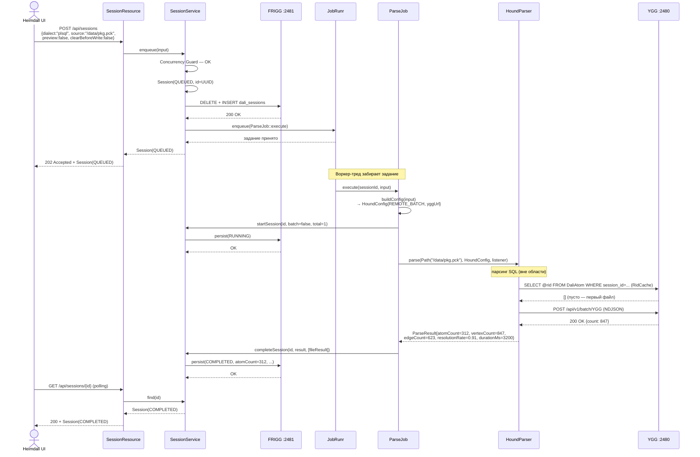
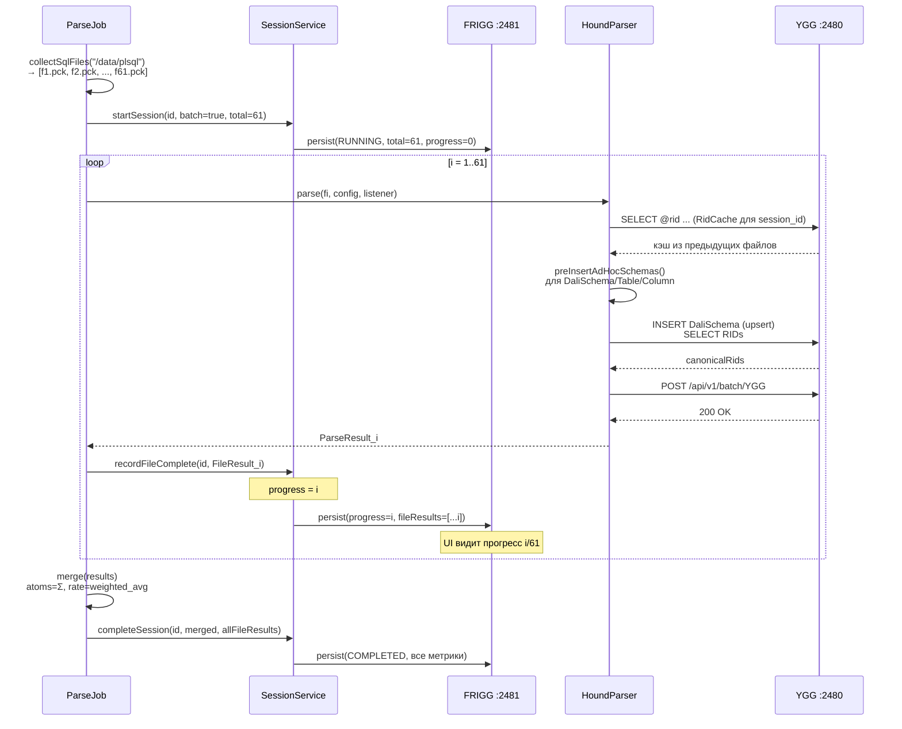
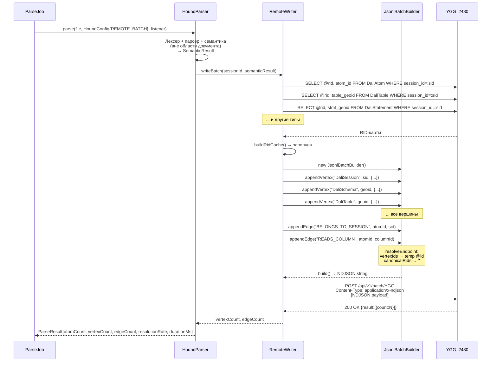
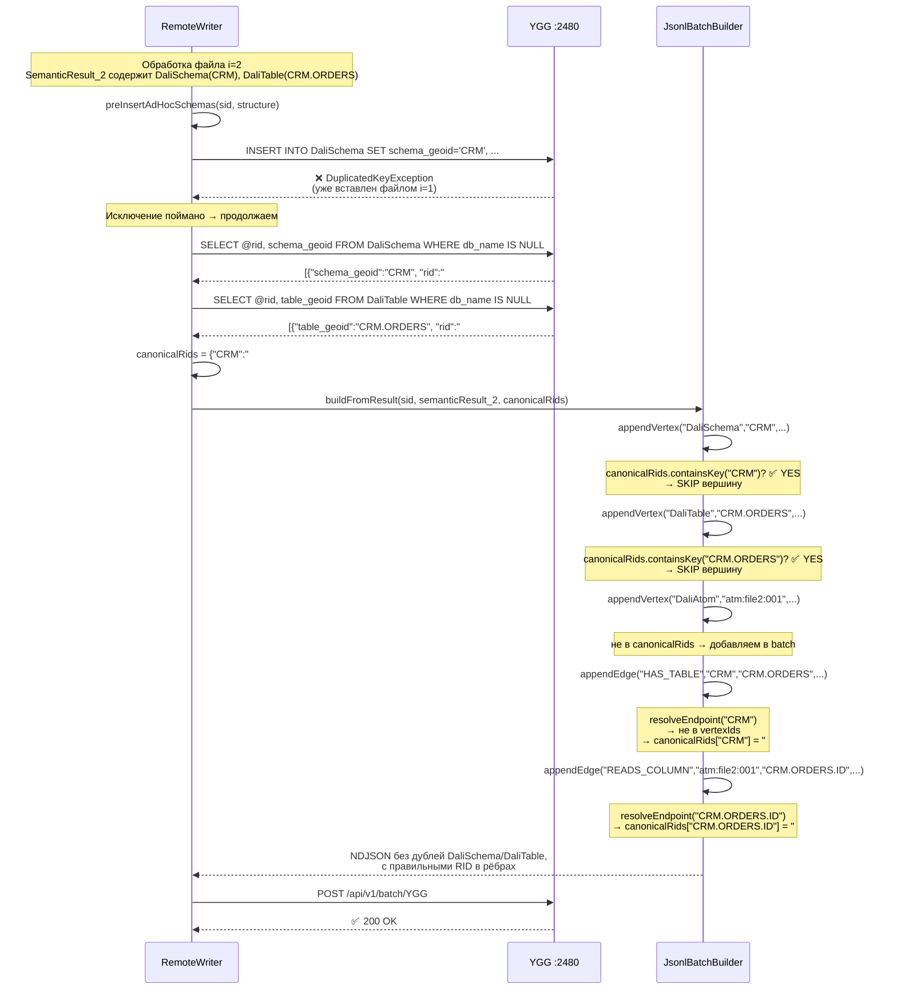
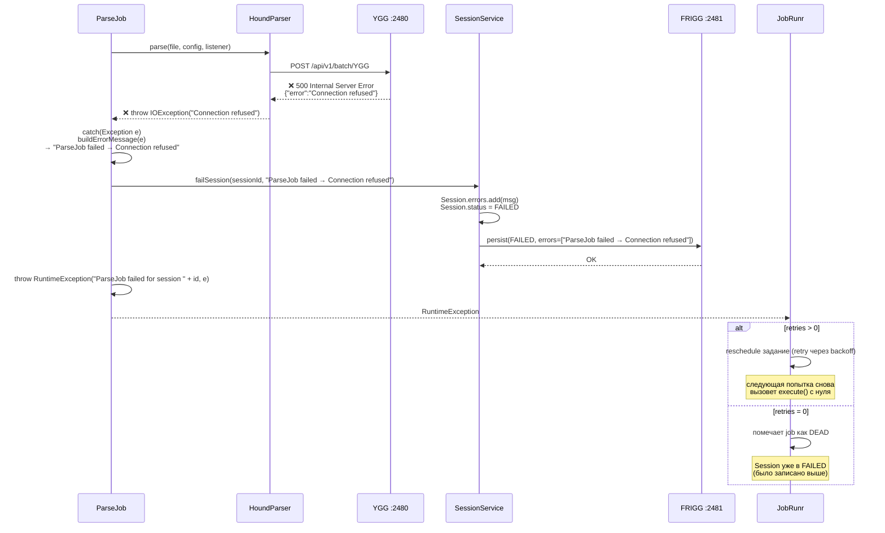

# Dali — Полный цикл выполнения задачи: от запроса до записи в YGG

> Дата: 2026-04-13 · Sprint S1  
> Область: `services/dali` → `libraries/hound` → YGG (:2480)  
> Вне области: алгоритмы парсинга SQL, семантический анализ, построение AST

---

## Содержание

1. [Обзор потока управления](#1-обзор-потока-управления)
2. [Фаза 1 — Приём запроса (REST → SessionService)](#2-фаза-1--приём-запроса-rest--sessionservice)
   - 2.1 [Валидация и Concurrency Guard](#21-валидация-и-concurrency-guard)
   - 2.2 [Создание Session и постановка в очередь](#22-создание-session-и-постановка-в-очередь)
   - 2.3 [Персистентность в FRIGG](#23-персистентность-в-frigg)
3. [Фаза 2 — Исполнение задания (ParseJob)](#3-фаза-2--исполнение-задания-parsejob)
   - 3.1 [Построение HoundConfig](#31-построение-houndconfig)
   - 3.2 [clearBeforeWrite — предварительная очистка YGG](#32-clearbeforewrite--предварительная-очистка-ygg)
   - 3.3 [Однофайловый режим (runSingle)](#33-однофайловый-режим-runsingle)
   - 3.4 [Пакетный режим (runBatch)](#34-пакетный-режим-runbatch)
   - 3.5 [Агрегация результатов (merge)](#35-агрегация-результатов-merge)
   - 3.6 [Обработка ошибок](#36-обработка-ошибок)
4. [Фаза 3 — Взаимодействие Hound с YGG](#4-фаза-3--взаимодействие-hound-с-ygg)
   - 4.1 [Что Hound получает от Dali](#41-что-hound-получает-от-dali)
   - 4.2 [Построение RidCache](#42-построение-ridcache)
   - 4.3 [Предварительная вставка канонических вершин (preInsertAdHocSchemas)](#43-предварительная-вставка-канонических-вершин-preinsertadhocschemas)
   - 4.4 [Сборка NDJSON Batch (JsonlBatchBuilder)](#44-сборка-ndjson-batch-jsonlbatchbuilder)
   - 4.5 [Отправка batch в ArcadeDB](#45-отправка-batch-в-arcadedb)
   - 4.6 [ParseResult — что возвращается в Dali](#46-parseresult--что-возвращается-в-dali)
5. [Sequence-диаграммы](#5-sequence-диаграммы)
   - 5.1 [Полный цикл: однофайловый парсинг](#51-полный-цикл-однофайловый-парсинг)
   - 5.2 [Полный цикл: пакетный парсинг](#52-полный-цикл-пакетный-парсинг)
   - 5.3 [Hound → YGG: один вызов parse()](#53-hound--ygg-один-вызов-parse)
   - 5.4 [Hound → YGG: дедупликация в batch-режиме](#54-hound--ygg-дедупликация-в-batch-режиме)
   - 5.5 [Обработка ошибки на уровне ParseJob](#55-обработка-ошибки-на-уровне-parsejob)
6. [Состояния и переходы Session](#6-состояния-и-переходы-session)
7. [Переменные конфигурации](#7-переменные-конфигурации)

---

## 1. Обзор потока управления

```
 Heimdall UI
     │
     │  POST /api/sessions
     ▼
 SessionResource          ← валидирует тело запроса
     │
     │  enqueue(ParseSessionInput)
     ▼
 SessionService           ← проверяет concurrency, создаёт Session(QUEUED),
     │                       сохраняет в FRIGG, передаёт в JobRunr
     │
     │  jobScheduler.enqueue(ParseJob::execute)
     ▼
 JobRunr                  ← ставит задание в in-memory очередь
     │
     │  (воркер-тред)
     ▼
 ParseJob.execute()       ← строит HoundConfig, управляет жизненным
     │                       циклом сессии, вызывает Hound
     │
     │  HoundParser.parse(file, config, listener)
     ▼
 HoundParser              ← парсит SQL (вне области этого документа),
     │                       формирует SemanticResult
     │
     │  RemoteWriter.writeBatch(sid, semanticResult)
     ▼
 RemoteWriter             ← строит RidCache, решает задачу дедупликации,
     │                       собирает NDJSON batch
     │
     │  POST /api/v1/batch/YGG  (NDJSON)
     ▼
 YGG :2480 (ArcadeDB)     ← принимает граф вершин и рёбер
```

---

## 2. Фаза 1 — Приём запроса (REST → SessionService)

### 2.1 Валидация и Concurrency Guard

**Файл:** `SessionResource.java` + `SessionService.java`

```
POST /api/sessions
Content-Type: application/json

{
  "dialect":          "plsql",
  "source":           "C:/Dali_tests/test_plsql",
  "preview":          false,
  "clearBeforeWrite": true
}
```

`SessionResource.create()` сначала проверяет обязательные поля:

```java
if (input == null || input.dialect() == null || input.source() == null)
    return 400 Bad Request
```

Затем вызывает `SessionService.enqueue(input)`, который выполняет **Concurrency Guard** (только для `preview=false`):

```
Если clearBeforeWrite=true:
    Есть ли в памяти сессия со статусом QUEUED или RUNNING?
    └── ДА → IllegalStateException → SessionResource ловит → 409 Conflict

Если clearBeforeWrite=false:
    Есть ли в памяти сессия (QUEUED|RUNNING) у которой clearBeforeWrite=true?
    └── ДА → IllegalStateException → 409 Conflict

Иначе → продолжаем
```

Зачем хранить `clearBeforeWrite` в `Session`? Именно для этой проверки: когда приходит новый запрос, нужно знать режим уже *запущенных* сессий, а не только новой.

---

### 2.2 Создание Session и постановка в очередь

```java
// SessionService.enqueue()
String sessionId = UUID.randomUUID().toString();
Instant now = Instant.now();

Session session = new Session(
    sessionId,
    SessionStatus.QUEUED,
    0,                        // progress
    0,                        // total (неизвестен до старта job)
    false,                    // batch (неизвестен до старта job)
    input.clearBeforeWrite(), // snapshot
    input.dialect(),          // snapshot
    input.source(),           // snapshot
    now,                      // startedAt
    now,                      // updatedAt
    null, null, null,         // atomCount, vertexCount, edgeCount — неизвестны
    null, null,               // resolutionRate, durationMs
    List.of(),                // warnings
    List.of(),                // errors
    List.of()                 // fileResults
);

sessions.put(sessionId, session);   // in-memory ConcurrentHashMap
persist(session);                   // → FRIGG
jobScheduler.get().<ParseJob>enqueue(j -> j.execute(sessionId, input));
```

`jobScheduler.get()` — ленивая инъекция (`Instance<JobScheduler>`): JobRunr инициализируется позже, чем `StartupEvent`, поэтому разрешение откладывается до первого использования.

Лямбда `j -> j.execute(sessionId, input)` сериализуется JobRunr в JSON и сохраняется в `InMemoryStorageProvider`. Воркер-тред извлекает её и рефлекторно вызывает `ParseJob.execute(sessionId, input)`.

---

### 2.3 Персистентность в FRIGG

Каждое изменение сессии вызывает `persist(session)`:

```java
private void persist(Session session) {
    try {
        repository.save(session);   // → FriggGateway → HTTP → ArcadeDB :2481
        friggHealthy = true;
    } catch (Exception e) {
        friggHealthy = false;
        log.warn("failed to persist session {}: {}", session.id(), e.getMessage());
        // сессия остаётся в памяти — деградируем gracefully
    }
}
```

`SessionRepository.save()` выполняет **upsert** через DELETE+INSERT:

```sql
DELETE FROM dali_sessions WHERE id = :id
INSERT INTO dali_sessions SET id = :id, startedAt = :startedAt, sessionJson = :json
```

`:json` — полная JSON-сериализация `Session` через Jackson. Хранение как blob-поле позволяет не менять схему FRIGG при добавлении полей в `Session`.

---

## 3. Фаза 2 — Исполнение задания (ParseJob)

**Файл:** `ParseJob.java`  
**Аннотация:** `@Job(name = "Parse SQL files", retries = 3)`

JobRunr вызывает `ParseJob.execute(sessionId, input)` в фоновом треде.

```java
@Job(name = "Parse SQL files", retries = 3)
public void execute(String sessionId, ParseSessionInput input) {
    try {
        HoundConfig config = buildConfig(input);

        if (!input.preview() && input.clearBeforeWrite()) {
            houndParser.cleanAll(config);
        }

        Path sourcePath = Path.of(input.source().strip());
        if (Files.isDirectory(sourcePath)) {
            runBatch(sessionId, sourcePath, config, input);
        } else {
            runSingle(sessionId, sourcePath, config);
        }
    } catch (Exception e) {
        String msg = buildErrorMessage(e);
        sessionService.failSession(sessionId, msg);
        throw new RuntimeException("ParseJob failed for session " + sessionId, e);
        // RuntimeException → JobRunr попытается retry (до 3 раз)
    }
}
```

---

### 3.1 Построение HoundConfig

`HoundConfig` — неизменяемый record с параметрами для Hound.

```java
private HoundConfig buildConfig(ParseSessionInput input) {

    if (input.preview()) {
        // DISABLED: Hound парсит, но ничего не пишет в YGG
        return HoundConfig.defaultDisabled(input.dialect());
        //  → writeMode = DISABLED
        //  → arcadeUrl  = null
    }

    // REMOTE_BATCH: Hound пишет через NDJSON batch в ArcadeDB
    return new HoundConfig(
        input.dialect(),
        null,                           // targetSchema — namespace не используется
        ArcadeWriteMode.REMOTE_BATCH,
        yggUrl,                         // "http://localhost:2480"
        yggDb,                          // "YGG"
        yggUser,                        // "root"
        yggPassword,                    // "root"
        Runtime.getRuntime().availableProcessors(),  // параллелизм
        false,                          // strictResolution = soft-fail
        5000,                           // batchSize (записей на HTTP-запрос)
        null                            // extra параметры
    );
}
```

| Параметр | preview=true | preview=false |
|----------|-------------|--------------|
| `writeMode` | `DISABLED` | `REMOTE_BATCH` |
| `arcadeUrl` | `null` | `http://localhost:2480` |
| `workerThreads` | все CPU | все CPU |
| `strictResolution` | false | false |
| `batchSize` | — | 5 000 |

---

### 3.2 clearBeforeWrite — предварительная очистка YGG

Выполняется **один раз** до любого парсинга, только если `clearBeforeWrite=true && preview=false`:

```java
houndParser.cleanAll(config);
```

Внутри Hound: серия SQL `DELETE FROM <type>` для каждого Dali-типа в YGG:

```sql
DELETE FROM DaliAtom;
DELETE FROM DaliAffectedColumn;
DELETE FROM DaliOutputColumn;
DELETE FROM DaliColumn;
DELETE FROM DaliTable;
DELETE FROM DaliSchema;
DELETE FROM DaliDatabase;
DELETE FROM DaliApplication;
DELETE FROM DaliStatement;
DELETE FROM DaliRoutine;
DELETE FROM DaliPackage;
DELETE FROM DaliParameter;
DELETE FROM DaliVariable;
DELETE FROM DaliRecord;
DELETE FROM DaliSession;
-- (все Dali edge types)
```

После этого YGG полностью чист для Dali-данных.

---

### 3.3 Однофайловый режим (runSingle)

```java
private void runSingle(String sessionId, Path file, HoundConfig config) {
    sessionService.startSession(sessionId, /*batch=*/false, /*total=*/1);
    //  → Session: status=RUNNING, total=1, batch=false

    DaliHoundListener listener = new DaliHoundListener(sessionId);
    ParseResult result = houndParser.parse(file, config, listener);
    //  ^ блокирующий вызов, выполняет парсинг + запись в YGG

    FileResult fr = toFileResult(result);
    sessionService.completeSession(sessionId, result, List.of(fr));
    //  → Session: status=COMPLETED, все поля заполнены
}
```

`DaliHoundListener` — реализация `HoundEventListener`, принимает события от Hound (начало файла, конец файла и т.д.) и логирует их. В текущей реализации не обновляет Session — прогресс не нужен для single-file.

---

### 3.4 Пакетный режим (runBatch)

```java
private void runBatch(String sessionId, Path dir, HoundConfig config,
                      ParseSessionInput input) throws IOException {

    List<Path> files = collectSqlFiles(dir);
    // Рекурсивный обход dir, фильтр по расширениям:
    //   .sql .pck .prc .pkb .pks .fnc .trg .vw
    // Сортировка: алфавитная (для воспроизводимости)

    if (files.isEmpty())
        throw new IllegalArgumentException("No SQL files found in directory: " + dir);

    sessionService.startSession(sessionId, /*batch=*/true, /*total=*/files.size());
    //  → Session: status=RUNNING, total=N, batch=true

    List<FileResult> fileResults = new ArrayList<>();

    for (Path file : files) {
        DaliHoundListener listener = new DaliHoundListener(sessionId);

        ParseResult result = houndParser.parse(file, config, listener);
        //  ^ каждый файл парсится независимо
        //    каждый вызов parse() создаёт ОДНУ вершину DaliSession в YGG

        FileResult fr = toFileResult(result);
        fileResults.add(fr);

        sessionService.recordFileComplete(sessionId, fr);
        //  → Session: progress++, fileResults.add(fr)
        //  → FRIGG: persist (позволяет UI видеть прогресс в реальном времени)
    }

    ParseResult merged = merge(input.source(), fileResults);
    sessionService.completeSession(sessionId, merged, fileResults);
    //  → Session: status=COMPLETED, агрегированные метрики
}
```

#### Сбор файлов

```java
private List<Path> collectSqlFiles(Path dir) throws IOException {
    try (Stream<Path> walk = Files.walk(dir)) {
        return walk
            .filter(Files::isRegularFile)
            .filter(p -> {
                String name = p.getFileName().toString().toLowerCase();
                return SQL_EXTENSIONS.stream().anyMatch(name::endsWith);
            })
            .sorted()       // алфавитная сортировка → детерминированный порядок
            .toList();
    }
}

private static final Set<String> SQL_EXTENSIONS = Set.of(
    ".sql", ".pck", ".prc", ".pkb", ".pks", ".fnc", ".trg", ".vw"
);
```

---

### 3.5 Агрегация результатов (merge)

После обработки всех файлов ParseJob агрегирует `List<FileResult>` → один `ParseResult`:

```java
private static ParseResult merge(String source, List<FileResult> results) {

    int atoms    = results.stream().mapToInt(FileResult::atomCount).sum();
    int vertices = results.stream().mapToInt(FileResult::vertexCount).sum();
    int edges    = results.stream().mapToInt(FileResult::edgeCount).sum();
    long duration = results.stream().mapToLong(FileResult::durationMs).sum();

    // Взвешенное среднее resolutionRate — вес = atomCount файла
    double rate = atoms > 0
        ? results.stream()
                 .mapToDouble(r -> r.resolutionRate() * r.atomCount())
                 .sum() / atoms
        : 0.0;

    List<String> warnings = results.stream()
        .flatMap(r -> r.warnings().stream()).toList();
    List<String> errors = results.stream()
        .flatMap(r -> r.errors().stream()).toList();

    return new ParseResult(source, atoms, vertices, edges, rate,
                           warnings, errors, duration);
}
```

Почему взвешенное среднее? Файл с 1 000 атомами и rate=0.50 должен весить в 10× больше, чем файл с 100 атомами и rate=0.99. Простое среднее давало бы искажённую картину.

---

### 3.6 Обработка ошибок

Если `HoundParser.parse()` бросает исключение (ошибка IO, ошибка записи в YGG, runtime):

```java
catch (Exception e) {
    String errorMsg = buildErrorMessage(e);
    sessionService.failSession(sessionId, errorMsg);
    throw new RuntimeException("ParseJob failed for session " + sessionId, e);
}
```

`buildErrorMessage(Throwable t)` — обходит цепочку `getCause()`, собирает уникальные сообщения:

```java
private static String buildErrorMessage(Throwable t) {
    var seen = new LinkedHashSet<String>();
    Throwable cur = t;
    while (cur != null) {
        String msg = cur.getMessage();
        if (msg != null && !msg.isBlank()) seen.add(msg.trim());
        cur = cur.getCause();
    }
    if (seen.isEmpty()) return t.getClass().getSimpleName();
    return String.join(" → ", seen);
}
```

Пример: `"Connection refused → DuplicatedKeyException on DaliTable"`

`failSession()` записывает сообщение в `Session.errors[]` и переводит в `FAILED`.

`throw RuntimeException` нужен для механизма retry JobRunr: если `retries=3` и задание ещё не исчерпало попытки, JobRunr переставит его в очередь. При каждой повторной попытке `execute()` снова вызовется с нуля — `startSession()` перезапишет статус в `RUNNING`.

---

## 4. Фаза 3 — Взаимодействие Hound с YGG

> В этом разделе описывается только как Hound записывает данные в YGG.  
> Алгоритмы лексического анализа, построения AST и семантического разбора — вне области.

### 4.1 Что Hound получает от Dali

При каждом вызове `houndParser.parse(file, config, listener)`:

| Параметр | Тип | Содержимое |
|----------|-----|-----------|
| `file` | `Path` | Абсолютный путь к .sql/.pck/... файлу |
| `config` | `HoundConfig` | Режим записи, URL YGG, credentials, параллелизм, dialect |
| `listener` | `HoundEventListener` | Коллбэки для событий парсинга (реализует `DaliHoundListener`) |

`config.writeMode` определяет что делать с результатом:
- `DISABLED` → `SemanticResult` строится, но запись в YGG не выполняется
- `REMOTE_BATCH` → `RemoteWriter.writeBatch()` отправляет данные в ArcadeDB

`session_id` передаётся через `config.extra` или как параметр writer'а. Все вершины в YGG получают `session_id` = UUID сессии Dali.

---

### 4.2 Построение RidCache

Перед отправкой NDJSON batch `RemoteWriter` строит `RidCache` — карту `geoid → ArcadeDB RID` для всех вершин, уже записанных ранее в рамках этой сессии.

Зачем? Рёбра в batch должны ссылаться на вершины либо по временному `@id` (если вершина в текущем batch), либо по реальному RID вида `#15:3` (если вершина уже существует в БД). Без кэша невозможно построить корректные рёбра.

```java
// Один запрос на тип вершины:
SELECT @rid AS rid, atom_id FROM DaliAtom WHERE session_id = :sid
SELECT @rid AS rid, table_geoid FROM DaliTable WHERE session_id = :sid
// ... и т.д. для каждого типа
```

Результат:
```
RidCache {
  tables:     { "CRM.ORDERS" → "#16:7",  "HR.EMPLOYEES" → "#16:8" }
  columns:    { "CRM.ORDERS.ID" → "#17:3", ... }
  statements: { "stmt:abc123" → "#18:1", ... }
  atoms:      { "hash:deadbeef" → "#19:42", ... }
  sessionRid: "#14:1"   // RID вершины DaliSession
}
```

---

### 4.3 Предварительная вставка канонических вершин (preInsertAdHocSchemas)

**Проблема:** При пакетном парсинге N файлов каждый файл парсится отдельным вызовом `parse()`. Если файл 1 и файл 2 оба ссылаются на схему `CRM` и таблицу `CRM.ORDERS`:

- Файл 1 вставляет `DaliSchema(CRM)` и `DaliTable(CRM.ORDERS)` → OK
- Файл 2 пытается вставить те же вершины → `DuplicatedKeyException` (уникальный индекс по `schema_geoid` / `table_geoid`)

**Решение:** Перед отправкой batch для файла i вызывается `preInsertAdHocSchemas()`:

```
Для каждой DaliSchema в текущем SemanticResult:
    1. Попробовать INSERT INTO DaliSchema SET schema_geoid=..., ...
    2. Если DuplicatedKeyException → уже существует, игнорируем
    3. Запросить @rid всех DaliSchema (новых и существующих)
    4. Добавить в результирующую Map<geoid, RID>

Для DaliTable и DaliColumn:
    1. Запросить @rid уже существующих (без попытки INSERT)
    2. Новые таблицы/столбцы включаются в batch как обычно
    3. Существующие → добавить в Map<geoid, RID>

Вернуть Map<geoid, actualRID>
```

Эта Map передаётся в `JsonlBatchBuilder` как `canonicalRids`.

---

### 4.4 Сборка NDJSON Batch (JsonlBatchBuilder)

`JsonlBatchBuilder` собирает текстовый payload из двух частей: сначала все вершины, затем все рёбра.

#### Вершины

```java
public void appendVertex(String type, String extId, Map<String, Object> props) {
    if (extId != null && !vertexIds.add(extId)) return; // дедупликация внутри batch
    vertices.append(toJsonLine("vertex", type, extId, null, null, props)).append('\n');
    vertexCount++;
}
```

Если `extId` уже добавлен в этот batch — пропускаем (защита от дублей внутри одного файла).
Если `extId` есть в `canonicalRids` — вершина в batch **не включается** (уже в БД):

```java
// Логика в buildFromResult():
if (canonicalRids.containsKey(geoid)) {
    // не вызываем appendVertex — пропускаем
    continue;
}
appendVertex("DaliSchema", geoid, props);
```

#### Рёбра

```java
public void appendEdge(String edgeType, String fromId, String toId, Map<String, Object> props) {
    String resolvedFrom = resolveEndpoint(fromId);
    String resolvedTo   = resolveEndpoint(toId);
    if (resolvedFrom == null || resolvedTo == null) return; // невалидное ребро — пропускаем
    edges.append(toJsonLine("edge", edgeType, null, resolvedFrom, resolvedTo, props)).append('\n');
    edgeCount++;
}

private String resolveEndpoint(String geoid) {
    if (vertexIds.contains(geoid))   return geoid;       // batch-локальный @id
    if (canonicalRids.containsKey(geoid)) return canonicalRids.get(geoid); // реальный RID "#N:M"
    return null; // ни там ни там — ребро не строим
}
```

#### Пример NDJSON payload

```ndjson
{"@type":"vertex","@cat":"v","@class":"DaliSession","@id":"sess:abc","session_id":"abc","source":"/data/pkg.pck"}
{"@type":"vertex","@cat":"v","@class":"DaliRoutine","@id":"rtn:crm_pkg","session_id":"abc","routine_name":"GET_ORDER"}
{"@type":"vertex","@cat":"v","@class":"DaliStatement","@id":"stmt:1","session_id":"abc","stmt_type":"SELECT"}
{"@type":"vertex","@cat":"v","@class":"DaliAtom","@id":"atm:001","session_id":"abc","atom_type":"COLUMN_REF"}
{"@type":"edge","@cat":"e","@class":"BELONGS_TO_SESSION","@from":"atm:001","@to":"sess:abc"}
{"@type":"edge","@cat":"e","@class":"HAS_STATEMENT","@from":"rtn:crm_pkg","@to":"stmt:1"}
{"@type":"edge","@cat":"e","@class":"READS_COLUMN","@from":"atm:001","@to":"#17:3"}
```

Последнее ребро: `@to="#17:3"` — это реальный ArcadeDB RID для `DaliColumn` из `canonicalRids`, потому что столбец был уже вставлен при обработке предыдущего файла.

---

### 4.5 Отправка batch в ArcadeDB

```
POST http://localhost:2480/api/v1/batch/YGG
Authorization: Basic cm9vdDpyb290
Content-Type: application/x-ndjson

<NDJSON payload>
```

ArcadeDB обрабатывает записи последовательно в рамках транзакции. Если `batchSize=5000` превышен — Hound разбивает на несколько HTTP-запросов автоматически.

**Ответ успеха:**
```json
{ "result": [{"count": 1423}] }
```

**Ответ ошибки (пример):**
```json
{ "error": "DuplicatedKeyException: Found duplicate key ... on index DaliSchema[schema_geoid]" }
```

---

### 4.6 ParseResult — что возвращается в Dali

После записи в YGG `HoundParser.parse()` возвращает:

```java
public record ParseResult(
    String       file,           // путь к обработанному файлу
    int          atomCount,      // число DaliAtom вершин, записанных в YGG
    int          vertexCount,    // общее число вершин (всех типов)
    int          edgeCount,      // общее число рёбер
    double       resolutionRate, // доля успешно разрешённых ссылок [0.0–1.0]
    List<String> warnings,       // мягкие предупреждения
    List<String> errors,         // ошибки без исключения
    long         durationMs      // время parse() + write в миллисекундах
)
```

`ParseJob` использует эти данные для:
- `toFileResult(result)` → `FileResult` для данного файла
- `sessionService.completeSession(id, result, fileResults)` — финальное обновление Session
- `sessionService.recordFileComplete(id, fr)` — промежуточный прогресс (в batch)

---

## 5. Sequence-диаграммы

### 5.1 Полный цикл: однофайловый парсинг



---

### 5.2 Полный цикл: пакетный парсинг



---

### 5.3 Hound → YGG: один вызов parse()



---

### 5.4 Hound → YGG: дедупликация в batch-режиме

Показывает обработку файла `i=2`, когда схема `CRM` и таблица `CRM.ORDERS` уже записаны файлом `i=1`.



---

### 5.5 Обработка ошибки на уровне ParseJob



---

## 6. Состояния и переходы Session

```
                    ┌─────────────────────────┐
                    │         QUEUED          │
                    │  progress=0, total=0    │
                    │  все result-поля=null   │
                    └────────────┬────────────┘
                                 │ ParseJob.execute() стартовал
                                 │ startSession(id, batch, total)
                                 ▼
                    ┌─────────────────────────┐
                    │         RUNNING         │
                    │  total=N                │
                    │  batch=true|false       │
                    │  progress растёт 0..N   │◄─── recordFileComplete()
                    └────────────┬────────────┘         (batch only)
                                 │
                   ┌─────────────┴──────────────┐
                   │                            │
                   │ completeSession()          │ failSession(msg)
                   ▼                            ▼
    ┌──────────────────────────┐  ┌──────────────────────────┐
    │        COMPLETED         │  │          FAILED          │
    │  progress = total        │  │  errors = [msg]          │
    │  atomCount, vertexCount  │  │  partial fileResults     │
    │  edgeCount, durationMs   │  │  (batch: до падения)     │
    │  resolutionRate          │  │                          │
    │  warnings, fileResults   │  │                          │
    └──────────────────────────┘  └──────────────────────────┘
              ▲ TERMINAL                  ▲ TERMINAL
              │ polling остановлен        │ polling остановлен
```

#### Какие поля меняются на каждом переходе

| Метод | Поля |
|-------|------|
| `enqueue()` | `id`, `status=QUEUED`, `startedAt`, `updatedAt`, `dialect`, `source`, `clearBeforeWrite` |
| `startSession()` | `status=RUNNING`, `total`, `batch`, `updatedAt` |
| `recordFileComplete()` | `progress++`, `fileResults` append, `updatedAt` |
| `completeSession()` | `status=COMPLETED`, `progress=total`, `atomCount`, `vertexCount`, `edgeCount`, `resolutionRate`, `durationMs`, `warnings`, `errors`, `fileResults` |
| `failSession()` | `status=FAILED`, `errors` append, `updatedAt` |

При каждом вызове любого из этих методов:
1. `sessions.computeIfPresent(id, ...)` — создаёт **новый неизменяемый** экземпляр Session (record)
2. `persist(updated)` — отправляет в FRIGG

---

## 7. Переменные конфигурации

| Переменная | Где используется | Пример |
|-----------|-----------------|--------|
| `ygg.url` | `ParseJob.buildConfig()` → `HoundConfig.arcadeUrl` | `http://localhost:2480` |
| `ygg.db` | `HoundConfig.arcadeDbName` | `YGG` |
| `ygg.user` | `HoundConfig.arcadeUser` | `root` |
| `ygg.password` | `HoundConfig.arcadePassword` | `root` |
| `frigg.url` | `FriggClient` (MicroProfile REST) | `http://localhost:2481` |
| `frigg.db` | `FriggGateway.sql()` | `FRIGG` |
| `frigg.user` | `FriggGateway.basicAuth()` | `root` |
| `frigg.password` | `FriggGateway.basicAuth()` | `root` |

---

*Документ актуален для Sprint S1 (2026-04-13).*  
*Описание алгоритмов парсинга SQL (AST, семантический граф, resolve) — в документации библиотеки Hound.*
